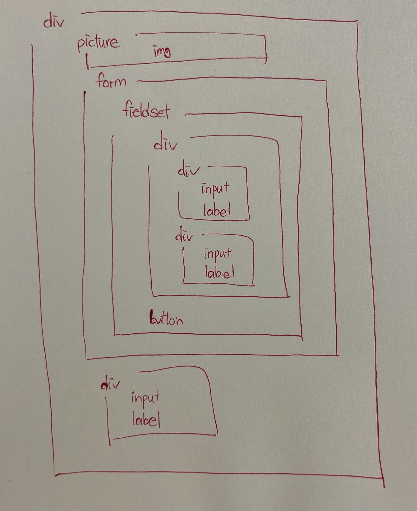

## Naver 로그인 폼 구현 과제

> 폼 요소

> picture 요소

> 미디어 쿼리

> 제출: 5월 11일

## Naver Structure

## 해결 과정

- 문제: svg를 지원하는 웹브라우저는 svg 형식으로,그렇지 않은 웹브라우저는 png 형식으로 보여지도록 구현 => 처음에 @supports인가 싶어서 헤맸다.

- 해결: picture 요소의 srcset 사용

- 레이아웃: 로고 -> img, login -> flex-container로 만든 후 가운데 정렬

- 문제: 로그인 서식과 버튼의 폭을 width: 100%로 하려면 어디에 지정?

- 해결: 아이디, 비밀번호, 버튼을 묶은 div에 적용

- 문제: 폼의 폭이 좁음. 아무리 width값을 설정해도 화면의 100%가 되지 않음.

- 해결: 알고 보니 전체 padding을 설정해 놓고 몰랐다.

- 문제: 로그인 상태유지 체크박스에서 label의 배경 이미지로 체크를 지정했을 때 배경과 글자의 간격 5px 어떻게 지정?

- 체크박스 위치를 position으로 일일히 찾아가면서 지정했는데 이것보다 효율적인 방법이 분명 있을 것 같다.....

- 문제: on-off는 어떤 요소로 구현?

- IP 보안 버튼을 만들기 위해 로그인 상태유지와 같이 div로 묶으니 CSS에 문제가 생겼다. 동일한 class의 div안의 input과 label이 두 개씩 생기니 동일한 배경 이미지가 생성되었다.

- 11시 59분 59초까지 고민 해보자......
